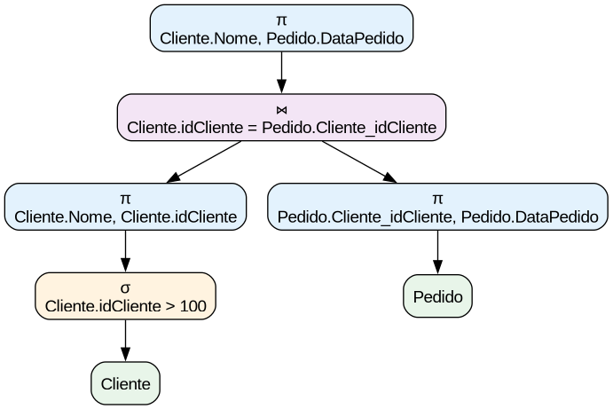

# Processador de Consultas SQL

Sistema de processamento e otimização de consultas SQL desenvolvido para a disciplina de Banco de Dados.

## 📋 Descrição

Este projeto implementa um processador de consultas que:

- Valida e faz parsing de consultas SQL
- Converte SQL para Álgebra Relacional
- Aplica heurísticas de otimização
- Constrói grafo de operadores
- Gera plano de execução

## 🎯 Histórias de Usuário Implementadas

### HU1 - Entrada e Validação da Consulta

✅ Interface gráfica com campo de entrada
✅ Validação de sintaxe SQL (SELECT, FROM, WHERE, JOIN, ON)
✅ Validação de operadores (=, >, <, <=, >=, <>, AND, ( ))
✅ Verificação de existência de tabelas e atributos

### HU2 - Conversão para Álgebra Relacional

✅ Conversão de SQL para álgebra relacional
✅ Representação com operadores σ (seleção), π (projeção) e ⋈ (junção)

### HU3 - Construção do Grafo de Operadores

✅ Grafo gerado em memória
✅ Visualização na interface
✅ Folhas representam tabelas
✅ Raiz representa projeção final

### HU4 - Otimização da Consulta

✅ Seleções que reduzem tuplas primeiro
✅ Projeções que reduzem atributos na sequência
✅ Evitar produto cartesiano
✅ Exibição do grafo otimizado

### HU5 - Plano de Execução

✅ Ordem de execução (bottom-up)
✅ Lista de operações ordenadas

## 🚀 Como Executar

### Requisitos

- Python 3.7 ou superior
- tkinter (geralmente já vem com Python)
- graphviz

### Executar a aplicação

```bash
python main.py
```

## 📝 Exemplos de Consultas

### Exemplo 1: Consulta Simples

```sql
SELECT Cliente.Nome, Pedido.DataPedido
FROM Cliente
JOIN Pedido ON Cliente.idCliente = Pedido.Cliente_idCliente
WHERE Cliente.idCliente > 100
```

### Exemplo 2: Múltiplos JOINs

```sql
SELECT Produto.Nome, Categoria.Descricao
FROM Produto
JOIN Categoria ON Produto.Categoria_idCategoria = Categoria.idCategoria
WHERE Produto.Preco > 50 AND Produto.QuantEstoque > 0
```

### Exemplo 3: Consulta Complexa

```sql
SELECT Cliente.Nome, Pedido.ValorTotalPedido, Status.Descricao
FROM Cliente
JOIN Pedido ON Cliente.idCliente = Pedido.Cliente_idCliente
JOIN Status ON Pedido.Status_idStatus = Status.idStatus
WHERE Pedido.ValorTotalPedido > 100 AND Status.idStatus = 2
```

## 🎓 Heurísticas de Otimização

O sistema aplica as seguintes heurísticas:

1. **Redução de Tuplas**: Aplicar seleções (σ) o mais cedo possível
2. **Redução de Atributos**: Aplicar projeções (π) logo após seleções
3. **Junções Restritivas**: Priorizar junções mais restritivas
4. **Evitar Produto Cartesiano**: Usar condições de junção explícitas

## 📚 Referências

- Elmasri & Navathe - Sistemas de Banco de Dados
- Silberschatz, Korth & Sudarshan - Database System Concepts
- Documentação oficial do projeto (PDF fornecido)

## 📄 Licença

Projeto acadêmico - Universidade de Fortaleza

---

**Desenvolvido para a disciplina de Gerenciamento de Banco de Dados**
